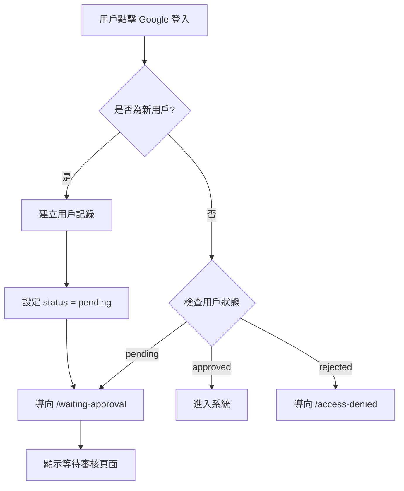
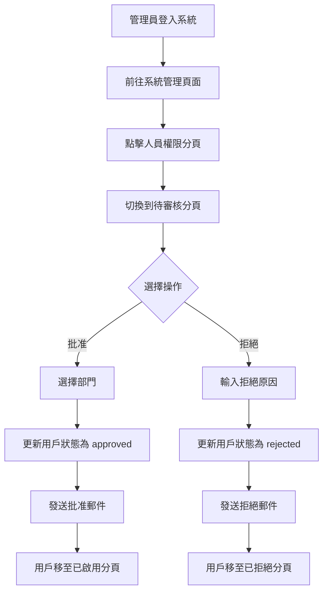
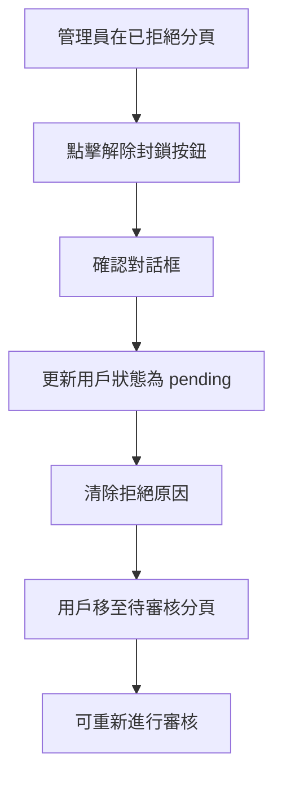

# 用戶審核系統完整說明

## 系統概述

Third-Party 管理系統已成功實現完整的用戶審核工作流程。當新用戶透過 Google OAuth 登入時，系統會自動將其標記為「待審核」狀態，並等待管理員批准後才能使用系統功能。

### 核心特性

✅ **自動審核流程**：新用戶自動進入待審核狀態  
✅ **三分頁管理介面**：已啟用、待審核、已拒絕  
✅ **部門分配**：批准時可指定用戶所屬部門  
✅ **郵件通知**：批准/拒絕時自動發送通知郵件  
✅ **解除封鎖**：可將已拒絕用戶重新設為待審核  
✅ **權限控管**：僅管理員可執行審核操作  

---

## 系統架構

### 資料庫結構

#### users 表（用戶表）

新增欄位：

```sql
status VARCHAR(20) DEFAULT 'pending'  -- 用戶狀態：pending/approved/rejected
department VARCHAR(255)               -- 所屬部門 ID
approved_by VARCHAR(255)              -- 批准者 ID
approved_at TIMESTAMP                 -- 批准時間
rejection_reason TEXT                 -- 拒絕原因
```

#### departments 表（部門表）

```sql
id VARCHAR(255) PRIMARY KEY
name VARCHAR(255) NOT NULL
description TEXT
created_at TIMESTAMP DEFAULT CURRENT_TIMESTAMP
updated_at TIMESTAMP DEFAULT CURRENT_TIMESTAMP
```

預設部門：
- IT 部門
- 人資部門
- 財務部門
- 業務部門
- 行政部門

### 核心檔案

| 檔案路徑 | 功能說明 |
|---------|---------|
| `app/routes/admin.tsx` | 管理後台主頁面，包含 action 函數處理審核操作 |
| `app/components/UserManager.tsx` | 用戶管理元件，三分頁介面 |
| `app/services/auth.server.ts` | 認證服務，處理登入時的狀態檢查 |
| `app/services/email.server.ts` | 郵件服務，發送批准/拒絕通知 |
| `app/routes/waiting-approval.tsx` | 待審核用戶看到的頁面 |
| `app/routes/access-denied.tsx` | 被拒絕用戶看到的頁面 |
| `db/schema/user.ts` | 用戶資料表結構定義 |
| `db/schema/department.ts` | 部門資料表結構定義 |
| `db/migrations/add_user_approval_system.sql` | 資料庫遷移 SQL |

---

## 功能流程

### 1. 新用戶註冊流程



**實作細節**：

1. 用戶透過 Google OAuth 完成認證
2. 系統檢查用戶是否已存在於資料庫
3. 如果是新用戶：
   - 建立用戶記錄，status 預設為 'pending'
   - 重新導向到 `/waiting-approval`
4. 如果是現有用戶：
   - 檢查 status 欄位
   - pending → `/waiting-approval`
   - approved → 進入系統
   - rejected → `/access-denied`

### 2. 管理員審核流程



**實作細節**：

#### 批准操作

1. 管理員在待審核分頁點擊「批准」按鈕
2. 彈出對話框，選擇用戶所屬部門
3. 提交表單，觸發 `approveUser` action
4. 後端執行：
   ```typescript
   - 查詢用戶資料
   - 查詢部門資料
   - 更新用戶狀態：
     * status = 'approved'
     * department = 選擇的部門 ID
     * approved_by = 當前管理員 ID
     * approved_at = 當前時間
   - 發送批准郵件
   ```
5. 返回成功訊息

#### 拒絕操作

1. 管理員在待審核分頁點擊「拒絕」按鈕
2. 彈出對話框，輸入拒絕原因
3. 提交表單，觸發 `rejectUser` action
4. 後端執行：
   ```typescript
   - 查詢用戶資料
   - 更新用戶狀態：
     * status = 'rejected'
     * rejection_reason = 輸入的原因
   - 發送拒絕郵件
   ```
5. 返回成功訊息

### 3. 解除封鎖流程



**實作細節**：

1. 管理員在已拒絕分頁找到用戶
2. 點擊「解除封鎖」按鈕
3. 確認操作
4. 後端執行：
   ```typescript
   - 更新用戶狀態：
     * status = 'pending'
     * rejection_reason = null
   ```
5. 用戶重新出現在待審核列表

---

## 郵件通知系統

### 批准通知郵件

**主旨**：✅ 您的帳號已通過審核

**內容包含**：
- 歡迎訊息
- 用戶姓名
- 分配的部門
- 登入系統的連結
- 聯繫資訊

**範本預覽**：

```html
🎉 帳號審核通過

親愛的 [用戶姓名]，您好：

恭喜您！您的 Third-Party 管理系統帳號已通過管理員審核，
現在可以開始使用系統了。

帳號資訊：
• 姓名：[用戶姓名]
• Email：[用戶郵箱]
• 部門：[部門名稱]

[立即登入系統]

如有任何問題，請聯繫系統管理員。
```

### 拒絕通知郵件

**主旨**：❌ 您的帳號申請未通過審核

**內容包含**：
- 拒絕通知
- 用戶姓名
- 拒絕原因
- 聯繫管理員的提示

**範本預覽**：

```html
帳號申請未通過

親愛的 [用戶姓名]，您好：

很遺憾通知您，您的 Third-Party 管理系統帳號申請未通過審核。

拒絕原因：
[管理員輸入的原因]

如果您認為這是一個錯誤，或需要進一步說明，
請聯繫系統管理員。

感謝您的理解與配合。
```

### 郵件服務設定

使用 **Resend** 作為郵件發送服務：

**環境變數**：
```env
RESEND_API_KEY=re_xxxxxxxxxxxx
FROM_EMAIL=noreply@yourdomain.com
FROM_NAME=Third-Party 管理系統
APP_URL=https://your-domain.com
```

**設定步驟**：
1. 註冊 Resend 帳號
2. 驗證發信網域
3. 取得 API Key
4. 設定環境變數

詳細說明請參考：[EMAIL_SETUP.md](./EMAIL_SETUP.md)

---

## 使用者介面

### 管理員介面

#### 人員權限管理頁面

**位置**：系統管理 > 人員權限

**三個分頁**：

1. **已啟用** (綠色標記)
   - 顯示所有 status = 'approved' 的用戶
   - 顯示用戶姓名、Email、部門、角色
   - 顯示「已啟用」綠色徽章

2. **待審核** (橘色標記，有數字徽章)
   - 顯示所有 status = 'pending' 的用戶
   - 顯示用戶姓名、Email、註冊時間
   - 提供「批准」和「拒絕」按鈕
   - 橘色背景突顯待處理項目

3. **已拒絕** (紅色標記)
   - 顯示所有 status = 'rejected' 的用戶
   - 顯示用戶姓名、Email、拒絕原因
   - 提供「解除封鎖」按鈕
   - 紅色背景標示已拒絕狀態

#### 批准對話框

- 顯示用戶資訊（姓名、Email）
- 部門下拉選單（必選）
- 取消 / 確認批准按鈕

#### 拒絕對話框

- 顯示用戶資訊（姓名、Email）
- 拒絕原因文字框（必填，多行）
- 取消 / 確認拒絕按鈕

### 用戶介面

#### 等待審核頁面 (`/waiting-approval`)

**顯示內容**：
- 時鐘圖示
- 「等待管理員審核」標題
- 說明文字：「您的帳號正在等待管理員審核...」
- 預計審核時間提示
- 聯繫資訊

**特點**：
- 簡潔友善的設計
- 無法訪問系統其他頁面
- 自動檢查審核狀態（可重新登入查看）

#### 拒絕頁面 (`/access-denied`)

**顯示內容**：
- 禁止圖示
- 「帳號申請未通過」標題
- 拒絕原因（從資料庫讀取）
- 聯繫管理員的提示
- 返回登入頁面的連結

**特點**：
- 清楚說明拒絕原因
- 提供聯繫方式
- 無法進入系統

---

## API 端點

### Admin Action 函數

**路徑**：`/admin` (POST)

#### 批准用戶

**參數**：
```typescript
{
  intent: 'approveUser',
  userId: string,
  departmentId: string
}
```

**回應**：
```typescript
{
  success: true,
  message: '用戶已批准，通知郵件已發送'
}
```

#### 拒絕用戶

**參數**：
```typescript
{
  intent: 'rejectUser',
  userId: string,
  reason: string
}
```

**回應**：
```typescript
{
  success: true,
  message: '用戶已拒絕，通知郵件已發送'
}
```

#### 解除封鎖

**參數**：
```typescript
{
  intent: 'unblockUser',
  userId: string
}
```

**回應**：
```typescript
{
  success: true,
  message: '用戶已解除封鎖，狀態改為待審核'
}
```

---

## 權限控管

### 管理員權限

**檢查方式**：`requireAdmin(request)`

**功能**：
- 驗證用戶是否為管理員
- 非管理員訪問 `/admin` 會被拒絕
- 返回 403 或重新導向

**實作**：
```typescript
export async function loader({ request }: LoaderFunctionArgs) {
  await requireAdmin(request);
  // ... 載入資料
}

export async function action({ request }: ActionFunctionArgs) {
  await requireAdmin(request);
  // ... 處理操作
}
```

### 用戶權限

**檢查方式**：`requireUser(request)`

**功能**：
- 驗證用戶是否已登入
- 檢查用戶狀態（pending/approved/rejected）
- 根據狀態重新導向到對應頁面

**實作**：
```typescript
export async function loader({ request }: LoaderFunctionArgs) {
  const user = await requireUser(request);
  // user.status 已經過檢查，這裡一定是 'approved'
}
```

---

## 資料庫遷移

### 執行遷移

**SQL 檔案**：`db/migrations/add_user_approval_system.sql`

**執行方式**：

```bash
# 使用 psql
psql $DATABASE_URL < db/migrations/add_user_approval_system.sql

# 或使用 Railway CLI
railway run psql < db/migrations/add_user_approval_system.sql
```

**遷移內容**：

1. 修改 users 表，新增欄位
2. 建立 departments 表
3. 插入預設部門資料
4. 將現有用戶狀態設為 'approved'

### 回滾（如需要）

```sql
-- 移除新增的欄位
ALTER TABLE users DROP COLUMN IF EXISTS status;
ALTER TABLE users DROP COLUMN IF EXISTS department;
ALTER TABLE users DROP COLUMN IF EXISTS approved_by;
ALTER TABLE users DROP COLUMN IF EXISTS approved_at;
ALTER TABLE users DROP COLUMN IF EXISTS rejection_reason;

-- 刪除 departments 表
DROP TABLE IF EXISTS departments;
```

---

## 部署檢查清單

### 部署前

- [ ] 資料庫遷移已執行
- [ ] 環境變數已設定（DATABASE_URL, GOOGLE_*, RESEND_API_KEY, etc.）
- [ ] Resend 網域已驗證
- [ ] 測試郵件發送成功
- [ ] 本地測試通過

### 部署後

- [ ] 確認 Railway 環境變數正確
- [ ] 檢查資料庫連線正常
- [ ] 測試新用戶註冊流程
- [ ] 測試管理員審核流程
- [ ] 測試郵件通知功能
- [ ] 檢查日誌無錯誤

### 環境變數清單

```env
# 必須設定
DATABASE_URL=postgresql://...
GOOGLE_CLIENT_ID=...
GOOGLE_CLIENT_SECRET=...
GOOGLE_REDIRECT_URI=...
SESSION_SECRET=...
RESEND_API_KEY=...
FROM_EMAIL=...
APP_URL=...

# 可選設定
FROM_NAME=Third-Party 管理系統
NODE_ENV=production
PORT=3000
```

---

## 常見問題 (FAQ)

### Q1: 新用戶無法登入？

**A**: 檢查用戶的 status 欄位：
- 如果是 'pending'，這是正常的，需要等待管理員批准
- 如果是 'rejected'，需要管理員解除封鎖
- 如果是 'approved'，檢查其他登入問題

### Q2: 郵件沒有發送？

**A**: 檢查以下項目：
1. RESEND_API_KEY 是否正確
2. FROM_EMAIL 的網域是否已驗證
3. 查看伺服器日誌中的錯誤訊息
4. 檢查 Resend Dashboard 的發送記錄

### Q3: 如何新增部門？

**A**: 目前需要直接在資料庫中新增：
```sql
INSERT INTO departments (id, name, description)
VALUES ('new-dept-id', '新部門名稱', '部門說明');
```

未來版本會提供管理介面。

### Q4: 如何將現有用戶設為管理員？

**A**: 在資料庫中更新：
```sql
UPDATE users
SET role = 'admin'
WHERE email = 'user@example.com';
```

### Q5: 批准時忘記選擇部門怎麼辦？

**A**: 系統會阻止提交，必須選擇部門。如果已經批准但想修改部門，需要在資料庫中手動更新。

### Q6: 可以批量批准用戶嗎？

**A**: 目前不支援批量操作，需要逐一批准。這是未來版本的改進項目。

### Q7: 用戶被拒絕後可以重新申請嗎？

**A**: 可以。管理員可以使用「解除封鎖」功能，將用戶狀態改回 'pending'，然後重新審核。

### Q8: 郵件會進入垃圾郵件匣嗎？

**A**: 可能會。建議：
- 確保 DNS 記錄（SPF、DKIM）正確設定
- 使用已驗證的專業網域
- 避免使用促銷性語言

---

## 系統限制

### 當前限制

1. **部門管理**：
   - 無法透過介面新增/編輯/刪除部門
   - 需要直接操作資料庫

2. **批量操作**：
   - 無法批量批准或拒絕用戶
   - 需要逐一處理

3. **審核歷史**：
   - 無法查看審核歷史記錄
   - 只能看到最終狀態

4. **郵件範本**：
   - 無法透過介面自訂郵件內容
   - 需要修改程式碼

5. **通知設定**：
   - 無法設定是否發送郵件
   - 批准/拒絕時一定會發送

### 未來改進

- [ ] 部門管理介面
- [ ] 批量審核功能
- [ ] 審核歷史記錄
- [ ] 郵件範本編輯器
- [ ] 通知設定選項
- [ ] 用戶申請時的自我介紹欄位
- [ ] 審核流程的備註功能
- [ ] 審核統計報表

---

## 技術細節

### 技術棧

- **前端**：React, Remix, TypeScript, Tailwind CSS
- **後端**：Remix Server Actions, Drizzle ORM
- **資料庫**：PostgreSQL (Railway)
- **認證**：Google OAuth 2.0
- **郵件**：Resend
- **部署**：Railway

### 效能考量

- 用戶列表使用分頁（目前未實作，但資料量小時無影響）
- 郵件發送為非阻塞操作
- 資料庫查詢已優化（使用索引）

### 安全性

- 所有審核操作需要管理員權限
- 使用 CSRF 保護（Remix 內建）
- 資料庫操作使用參數化查詢（防 SQL 注入）
- Session 使用加密儲存

---

## 相關文件

- [郵件服務設定指南](./EMAIL_SETUP.md)
- [測試清單](./USER_APPROVAL_TESTING.md)
- [資料庫遷移 SQL](../db/migrations/add_user_approval_system.sql)

---

## 版本資訊

**版本**：1.0.0  
**發布日期**：2026-02-03  
**作者**：Manus AI Agent  
**維護者**：Third-Party 開發團隊

---

## 授權與支援

本功能為 Third-Party 管理系統的一部分。

**技術支援**：
- GitHub Issues: https://github.com/inphic-ai/Third-Party/issues
- 系統管理員：kipoteam@...

**更新日誌**：
- 2026-02-03: 初始版本發布
  - 用戶審核系統
  - 三分頁管理介面
  - 郵件通知功能
  - 解除封鎖功能
